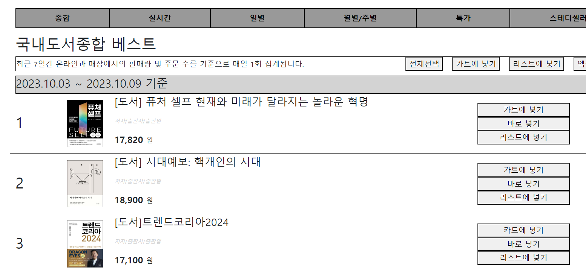

# yes24로 Node.js 연습



```
import express from "express";
import allRouter from "./routers/all.js";
import realtimeRouter from "./routers/realtime.js";
import dayRouter from "./routers/day.js";
import monthRouter from "./routers/month.js";
import saleRouter from "./routers/sale.js";
import steadyRouter from "./routers/steady.js";
const app = express();

app.listen(1010, () => {
  console.log("http://localhost:1010 실행중");
});

app.use("/list", allRouter);
app.use("/list/realtime", realtimeRouter);
app.use("/list/day", dayRouter);
app.use("/list/month", monthRouter);
app.use("/list/sale", saleRouter);
app.use("/list/steady", steadyRouter);

app.get("/", (req, res, next) => {
  res.send("홈화면");
});
```

```
import express from "express";

const router = express.Router();
router.use(express.json());
router.use(express.urlencoded());

const 국내종합도서 = [
  {
    id: 1,
    url: "https://image.yes24.com/goods/122090360/L",
    title: " 퓨처 셀프 현재와 미래가 달라지는 놀라운 혁명",
    price: "17,820",
  },
  {
    id: 2,
    url: "https://image.yes24.com/goods/122457906/L",
    title: " 시대예보: 핵개인의 시대",
    price: "18,900",
  },
  {
    id: 3,
    url: "https://image.yes24.com/goods/122426425/L",
    title: "트렌드코리아2024",
    price: "17,100",
  },
];

router.get("/", (req, res, next) => {
  res.render("list.ejs", { list: 국내종합도서, title: "국내도서종합" });
});

router.get("/all", (req, res, next) => {
  res.render("list.ejs", { list: 국내종합도서, title: "국내도서종합" });
});

export default router;
```

데이터를 사용하지 않고 ejs 파일에 바인딩하는 연습을 하였기 때문에 수기로 직접 arr값을 입력하여 바인딩하였다.
